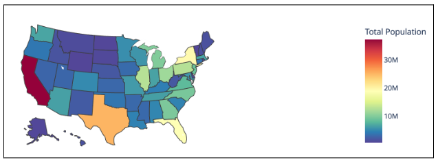
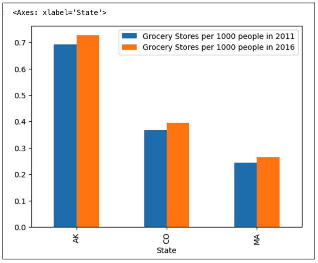
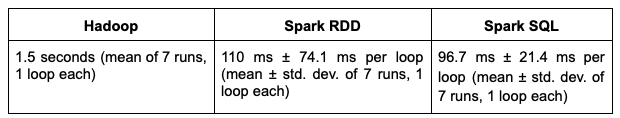
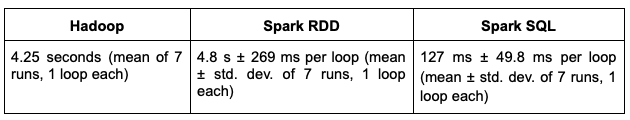

# Data Processing and Visualization: Hadoop vs. Spark

- [Project Intro](#project-intro)
  - [Task 1](#task-1)
  - [Task 2](#task-2)
- [Dataset Used](dataset-used)
- [Setup](#setup)
    - [Docker Setup](#docker-setup)
    - [Project Setup](#project-setup)
    - [Docker Info](#docker-info)
    - [Setting up and running Spark environment](#setting-up-and-running-spark-environment)
    - [Setting up Hadoop environment](#setting-up-hadoop-environment)
      - [Note for Mac users with Apple Silicon (M1 and M2)](#note-for-mac-users-with-apple-silicon-m1-and-m2)
      - [Running the Java files](#running-the-java-files)
    - [Important - Closing Docker containers](#important---closing-docker-containers)
- [Visualizations](#visualizations)
  - [Task 1 - State wise population map](#Task-1---State-wise-population-map)
  - [Task 2 - Top 3 States with max difference of grocery stores/1000 people between 2011-2016](#Task-2---Top-3-States-with-max-difference-of-grocery-stores/1000-people-between-2011-2016)
- [Runtimes for Spark and Hadoop](#runtimes-for-Spark-and-Hadoop)
  - [Task 1 Runtime](#task-1-runtime)
  - [Task 2 Runtime](#task-2-runtime)
- [SparkSQL vs SparkRDD vs Hadoop](#SparkSQL-vs-SparkRDD-vs-Hadoop)
  - [Runtime comparision](#Runtime-comparision)
  - [Ease of code comparision](#Ease-of-code-comparision)
    
    

## Project Intro

For this project, I have used [Spark](https://spark.apache.org/) and
[Hadoop](https://hadoop.apache.org/), big data frameworks that allow developers
to process massive amounts of data with parallelism and fault tolerance included
by default. In addition, I have used [Docker](https://www.docker.com/) to containerize
whole project which made installing dependencies and setting up the dev environment easier.

The project consists of two tasks as below. Both tasks are implemented using SparkSQl, SparkRDD, 
and Hadoop. The performance and ease of use for each method is compared.

### Task 1

For this task, I have calculated total population in each state in `2010` by summing the populations 
from its counties (from `SupplementalDataCounty.csv`). This data had some issues, I did some
cleaning to properly visualize it.

### Task 2

Task 2 involved comparing the average number of grocery stores available per 1000 people in each state, 
in 2011 and 2016. I vizualized this before-and-after in a double-bar graph.
([see method 1](https://www.geeksforgeeks.org/plot-multiple-columns-of-pandas-dataframe-on-bar-chart-with-matplotlib/))
`for the 3 states with the largest positive change between the years`.

Both tasks are done in SparkSQl, SparkRDD, and Hadoop and the performance and ease of use is compared against each other.

## Dataset used

In this project, I have used data from the USDA's Food Environment Atlas.

The data can be found in `data/` folder of this github.

[Data Source](https://www.ers.usda.gov/data-products/food-environment-atlas/data-access-and-documentation-downloads/)

Scroll down to `Data Set -> Food and Environment Atlas .csv Files` to download
the data. Create a new directory `data/` in the home directory of the repo, then
extract all of the files into it.

## Setup

In this project, the only setup required is:

- Docker
- a terminal to run shell commands
- a web browser to access localhost
- A code editor to write Java code

### Docker Setup

Go to [the Docker website](https://www.docker.com/get-started/), download the
installer, and install Docker with the default configuration. If you are on
Windows, it is highly recommended that you use Docker Desktop's WSL-based engine
([instructions here](https://docs.docker.com/desktop/wsl/)). Regardless, it will
ask you to restart. Do this and make sure Docker is opened before continuing.

### Project Setup

Clone this repository and cd into it. `spark/src/` and `hadoop/CS531_project` have the source code files
for the Spark and Hadoop respectively.

### Docker Info

The configuration of our docker container is defined in `docker-compose.yml`.
This configuration is the bare minimum to work on the project, but these
configurations can scale greatly, such as starting up multiple containers that
communicate with each other. The fields in this docker-compose file are image,
volumes, and ports.

- `build`: The path to the Dockerfile that the container is being built from.
  This pulls from [Docker Hub](https://hub.docker.com/), and the container's
  dependencies and installed packages are defined here. Additional configuration
  is defined in the Dockerfile
- `volumes`: This allows us to interact with our container's file system. Its
  elements are formatted as follows:
  `<local_path_relative_to_docker-compose.yml>:<absolute_path_in_docker_container>`
- `ports`: Mapping ports within our container to ports in our local machine. Its
  elements are formatted as follows: `<port_on_local>:<port_in_container>`

For more information on Docker Compose, see
[the Docker documentation](https://docs.docker.com/compose/compose-file/compose-file-v3/).

```yml
build: .
volumes:
  - ./src:/home/jovyan/src
  - ./data:/home/jovyan/data
ports:
  - 8888:8888
```

### Setting up and running Spark environment

To run the Spark environment in Jupyter Notebook,

cd into `spark/` folder of the cloned folder

run `docker compose build`

run `docker compose up`

For future runs, you only need to run `docker compose up`.
Running the build for the first time may take 5-10 minutes.

Look for this text in the terminal output:

```plaintext
To access the server, open this file in a browser:
file:///home/jovyan/.local/share/jupyter/runtime/jpserver-7-open.html
 Or copy and paste one of these URLs:
         http://476665dae8a3:8888/lab?token=<a_generated_token>
         http://127.0.0.1:8888/lab?token=<a_generated_token>
```

You will be using Jupyter Notebook to run your Python/PySpark code. See the
[Jupyter docs](https://docs.jupyter.org/en/latest/) for more info.

Open the second url (the one that starts with `127.0.0.1`) to open Jupyter Lab.
This is where you will find the jupyter notebooks for Task1 and Task2 named Task1Final and Task2Final.


### Setting up Hadoop environment

Running Hadoop code is a little more complicated. First, download the
[Hadoop binaries](https://www.apache.org/dyn/closer.cgi/hadoop/common/hadoop-3.3.6/hadoop-3.3.6.tar.gz)
and put the file in the `hadoop/` directory. Do not decompress the file.

Then, run `docker compose build`. This will take about 10 minutes.

To start the Docker container, run the command `docker compose up -d`. Note that
we add `-d`. This is because we want to run the container in detached mode so we
can use the same terminal while the container runs. To run the code, we will run
bash inside the container.

Run the command `docker compose exec hadoop bash` to run bash int he container.
Then, go to `/home/CS531_project`.

#### Note for Mac users with Apple Silicon (M1 and M2)

Whenever you bash into the container, you need to reset `JAVA_HOME`. To do this,
run the following two commands while in the container:

```bash
unset JAVA_HOME
export JAVA_HOME=/usr/lib/jvm/java-8-openjdk-arm64
```

This is all about setting up and running Docker container. 

Now, you can access the code files for Task1 in below folder of cloned project: 

`<cloned-folder>/hadoop/CS531_project/src/main/java/edu/csuf/cs/cs531/App.java`

Open the file in your code editor and write the code for Java, save it. The saved changes get reflected in Docker
container automatically.

Same for Task2, path for code file is given below: 

`<cloned-folder>/hadoop/CS531_project/src/main/java/edu/Task2.java`

### Running the Java files

If you want to run the Task1 file App.java, make below changes to pom.xml:

Open pom.xml located at `<cloned-folder>/hadoop/CS531_project/pom.xml`

Change `<mainClass>` tag to `<mainClass>edu.csuf.cs.cs531.App</mainClass>`

If you want to run the Task2 file Task2.java, then change `<mainClass>` tag to `<mainClass>edu.csuf.cs.cs531.Task2</mainClass>`

Whenever your code is ready to recompile, run the command `mvn package`. This
will compile your Java code into a jar.

To run the Task1 jar in Hadoop, run the following command:

```bash
hadoop jar target/CS531_project-1.0-SNAPSHOT.jar <path_to_input_file> <path_to_output_directory>
```

```bash
hadoop jar target/CS531_project-1.0-SNAPSHOT.jar <path_to_input_file> <path_to_output_directory1> <path_to_output_directory2> <path_to_output_directory3> 
```

Note that the output directory must not exist before running Hadoop.

Your results should be in `CS531_project/<your_output_directory_name>/part-r-00000` for Task1 and `CS531_project/<your_output_directory_name3>/part-r-00000`. 

### Important - Closing Docker containers

When you are finishing running your code, CTRL+C docker compose for Spark and type exit for Hadoop. 
For both Docker containers, make sure to run the command `docker compose down`. You
will not lose any saved files.

## Visualizations

### Task 1 - State wise population map



### Task 2 - Top 3 States with max difference of grocery stores/1000 people between 2011-2016



## Runtimes for Spark and Hadoop

### Task 1 Runtime



### Task 2 Runtime



## SparkSQL vs SparkRDD vs Hadoop

## Runtime comparision

For Task1, SparkSQL and SparkRDD based approaches work the best. SparkSQL (96.7 ms) is marginally better than SparkRDD (110 ms). Query optimizer of the SparkSQL does a good job in optimizing the filter, sum and group-by operations. On the other hand, Hadoop MapReduce (1.5 sec) performs the worst. The reason may be because MapReduce reads from and writes to the disk after each map and reduce operations, which can be significantly slower due to I/O latency. Spark, on the other hand, performs in-memory processing, which is faster as it reduces the need for disk I/O.

For Task2, SparkSQL (127 ms) again performs the best. Reason being the same, the query optimizer of the SparkSQL does a good job in optimizing the filter, sum, group-by and join operations. However, in this task, the performance of SparkSQL (127 ms) and SparkRDD (4.8 sec) differ by a huge margin. I think the reason for this is SparkSQL’s query optimizer is very good and also, SparkRDD is a black box approach and has no idea about the schema, which means developers have to optimize the transformations. MapReduce (4.25 sec) performs slightly better than SparkRDD but is still inefficient compared to SparkSQL. Again, because MapReduce reads from and writes to the disk after each map and reduce operations, which can be significantly slower due to I/O latency.

## Ease of code comparision

In terms of coding comfort, the three methods exhibit distinct advantages and disadvantages:

Hadoop MapReduce is the most difficult to code:
Verbose: Requires extensive boilerplate code, making it tedious and less readable.
Library-heavy: Involves numerous libraries, increasing complexity and debugging overhead.
Limited debugging tools: Debugging MapReduce jobs can be challenging due to the distributed nature of the process.

Spark RDD is easier than Hadoop:
Simple API: Offers a relatively straightforward API for basic operations like map and reduce.
Flexibility: Allows fine-grained control over data processing, enabling complex manipulations.
Debugging challenges: Similar to Hadoop, debugging map and reduce operations can be cumbersome.

Spark SQL is the easiest to code:
Intuitive: Utilizes familiar SQL syntax, making it easy for users with SQL knowledge.
Concise: Requires significantly fewer lines of code compared to Hadoop and RDDs.
Advanced optimization: Leverages Spark's optimization engine for efficient query execution.

Overall, Spark SQL emerges as the clear winner in terms of coding comfort. Its concise syntax, familiarity with SQL, and optimized execution make it a significantly more enjoyable and efficient coding experience.
